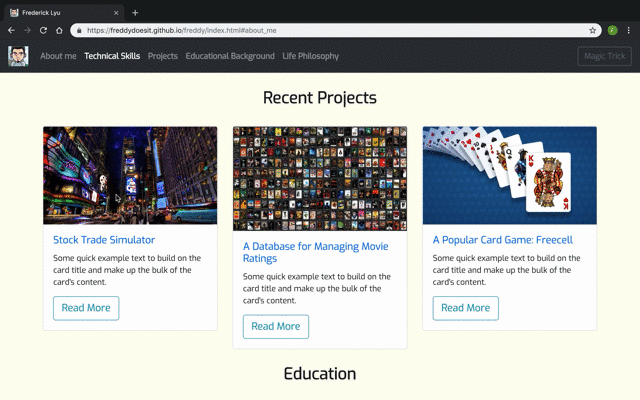

#  Intro to the [Home Page of Frederick](https://freddydoesit.github.io/freddy/)

Come on and check out my personal webpage where you can for sure find a new Freddy you never know. :smirk:

## Project Objective
This project has applied HTML5, CSS3, Bootstrap4 and some JavaScript to support all due effects. It serves as a opportunity to learn and understand better by applying and extending what I have learned in the lecture.

## Table of Contents
<details>
<summary>Expand to see contents</summary>

* **[Technologies](#technologies)**<br />
* **[Deployment](#deployment)**<br />
* **[Author](#author)**<br />
* **[Screenshot](#screenshot)**<br />
* **[License](#license)**<br />

</details>

## Technologies
For this project I have appiled: 
* HTML5
* CSS3
* Bootstrap4
* JavaScript
* Slick.js
* JQuery
* Git (Github)
* Google fonts

## Deployment
* For this project, you can click  [here](https://freddydoesit.github.io/freddy/) to check out the demostration. 
* You can also do this:
Navigate to the desktop of somewhere you prefer
```
$ mkdir webpage
$ cd webpage
$ git clone https://github.com/FreddyDoesIT/freddy.git
$ cd freddy
$ open index.html
```
## Author
[Frederick Lyu](https://freddydoesit.github.io/freddy/)

## Screenshot



## License
[](https://opensource.org/licenses/MIT)

This repository has the standard MIT license. You can find it [here.](https://opensource.org/licenses/MIT)